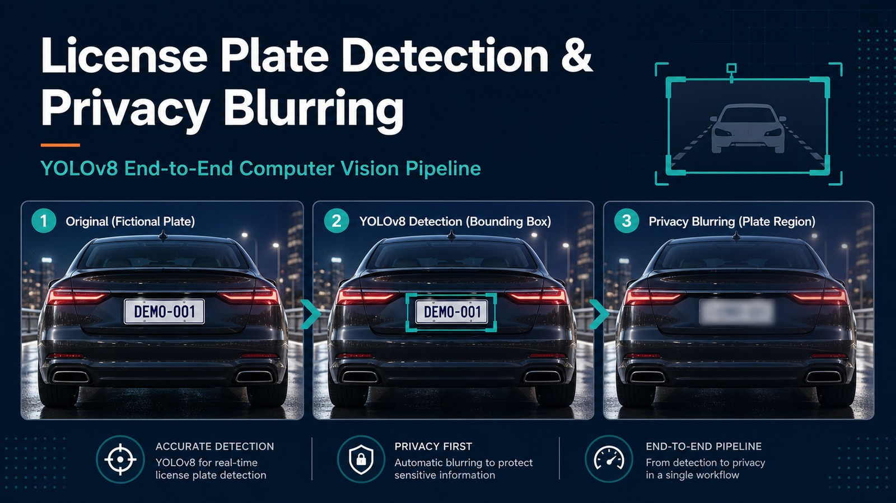
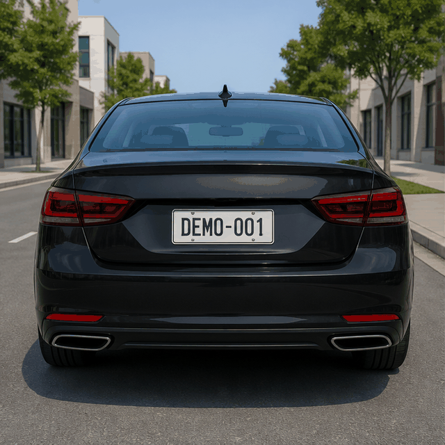
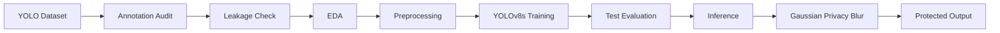
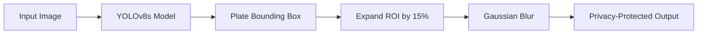
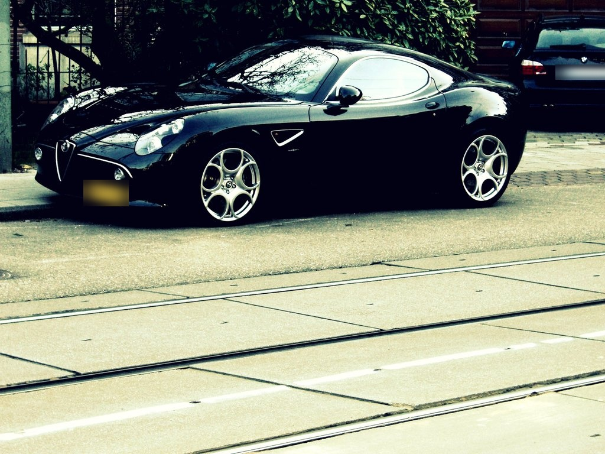

<p align="center">
  
</p>

# License Plate Detection & Privacy Blurring using YOLOv8

An end-to-end computer vision pipeline that detects vehicle license plates using
YOLOv8s and automatically applies Gaussian blur to preserve privacy.

[](https://www.python.org/)
[](https://docs.ultralytics.com/)
[](https://opencv.org/)
[](LICENSE)
[](https://github.com/banshiAbp/License-Plate-Detection-and-Blurring-using-YOLOv8/commits/main)
[](https://github.com/banshiAbp/License-Plate-Detection-and-Blurring-using-YOLOv8/stargazers)
[](license_plate_detection_case_study.pdf)

## Why This Project?

Vehicle license plates can expose personally identifiable vehicle information.
This project demonstrates how computer vision can automatically detect and
obscure plates for privacy-aware traffic monitoring, smart-city systems, and
public-dataset anonymization.

## Animated Demo

<p align="center">
  
</p>
<p align="center">
  <strong>Original Image &nbsp;&rarr;&nbsp; YOLO Detection &nbsp;&rarr;&nbsp; Privacy Blur</strong>
</p>
<p align="center"><em>Privacy-safe synthetic demonstration; no real plate is exposed.</em></p>

## Project Highlights

- **Dataset quality audit** across 25,158 images and YOLO annotations
- **Annotation validation** through image-label pairing and bounding-box overlays
- **Data leakage detection** using MD5 and perceptual hashes
- **YOLOv8s training** at `imgsz=960` for small, detail-sensitive plates
- **Untouched test-set evaluation** on 386 images and 512 plate instances
- **Privacy protection metrics** based on ground-truth plate coverage
- **CPU inference benchmark** for deployment planning
- **Failure-case analysis** covering misses, partial coverage, and false positives

## Architecture



## Inference Architecture



## Results

| Metric | Result |
|---|---:|
| Precision | **0.916** |
| Recall | **0.861** |
| mAP@50 | **0.912** |
| mAP@50-95 | **0.670** |
| Plates protected at 95% coverage | **445 / 512** |
| Plate privacy protection at 95% coverage | **86.91%** |
| Image-level privacy pass rate | **85.75%** |
| CPU throughput | **1.73 FPS** |

The privacy metric is intentionally stricter than standard object-detection IoU:
a plate counts as protected only when the blurred prediction covers at least 95%
of its ground-truth area.

## Quick Start

### 1. Clone and install

```bash
git clone https://github.com/banshiAbp/License-Plate-Detection-and-Blurring-using-YOLOv8.git
cd License-Plate-Detection-and-Blurring-using-YOLOv8

python -m venv .venv
```

Activate the environment:

```bash
# Windows PowerShell
.\.venv\Scripts\Activate.ps1

# macOS/Linux
source .venv/bin/activate
```

Install dependencies:

```bash
pip install -r requirements.txt
```

### 2. Add trained weights

Model weights are intentionally not published in the repository. Copy a trained
YOLOv8 checkpoint to:

```text
weights/best.pt
```

Alternatively, pass a local checkpoint with `--weights`.

### 3. Run privacy blurring

```bash
python predict.py --source path/to/image.jpg
```

For a directory:

```bash
python predict.py --source path/to/images --device cpu
```

Detected and blurred images are written to `demo_outputs/`.

## De-identified Sample Output

The following real test output is safe to share because detected plate regions
have already been blurred.

<p align="center">
  
</p>

## Failure-Case Review

The project reports difficult cases rather than showing only successful examples.
Remaining risks include completely missed plates, partial plate coverage, angled or
distant plates, multiple-vehicle scenes, and occasional false-positive blur regions.

Detailed failure examples and privacy limitations are documented in the
[case-study report](license_plate_detection_case_study.pdf). Raw plate imagery is
not duplicated in the public README.

## Technologies

- Python
- Ultralytics YOLOv8
- OpenCV
- PyTorch
- NumPy
- Pandas
- Matplotlib
- Jupyter Notebook

## Repository Structure

```text
.
|-- docs/assets/                          # README visuals
|-- weights/best.pt                       # Local trained model (ignored by Git)
|-- predict.py                            # Simple image/directory inference
|-- license_plate_detection_case_study.ipynb
|-- license_plate_detection_case_study.pdf
|-- data.yaml                             # Training configuration
|-- data_eval.yaml                        # Evaluation configuration
|-- splits/                               # Reproducible split manifests
|-- step_01_annotation_audit.py
|-- step_02_local_model_outputs.py
|-- step_03_privacy_blur_metrics.py
|-- step_04_inference_benchmark.py
|-- step_05_dataset_leakage_check.py
|-- step_06_padding_experiment.py
`-- requirements.txt
```

The full image dataset, labels, training runs, and generated output directories are
excluded from Git because they are large reproducible artifacts.

## Reproduce the Analysis

Open and run:

```text
license_plate_detection_case_study.ipynb
```

The notebook covers annotation auditing, coordinate conversion, EDA, leakage
checks, YOLOv8 configuration, model evaluation, privacy coverage, threshold
sensitivity, failure analysis, and CPU benchmarking.

The complete rendered report is available here:
[license_plate_detection_case_study.pdf](license_plate_detection_case_study.pdf).

## What I Learned

- Annotation quality directly affects both detection and privacy protection.
- Evaluation should use an untouched test set rather than validation metrics alone.
- Deployment benchmarking is as important as training accuracy.
- Privacy applications need domain-specific metrics beyond mAP and IoU.
- Failure cases and image-level pass rates reveal risks hidden by aggregate metrics.
- Moderate over-blurring is safer than leaving readable plate characters exposed.

## Challenges Faced

- Detecting plates that occupy only a small portion of high-resolution images
- Identifying missing, malformed, or mismatched image-label pairs
- Auditing exact and near-duplicate images across dataset splits
- Balancing inference speed with the recall needed for privacy protection
- Working within limited training runtime and compute resources
- Designing a coverage-based privacy metric beyond standard detection scores

## Future Improvements

- Export the model to ONNX Runtime for portable CPU deployment
- Add TensorRT optimization for higher-throughput GPU inference
- Support real-time video streams with ByteTrack or DeepSORT tracking
- Package inference behind a FastAPI service and Docker image
- Evaluate across additional cameras, lighting conditions, and countries
- Add carefully governed OCR only where legally justified and privacy-safe

## Limitations and Responsible Use

The model provides an automated privacy layer, not a strict privacy guarantee.
It should be monitored for missed, small, angled, low-light, and motion-blurred
plates. Production use should prioritize recall, validate performance on the
target camera domain, and include a review path for high-risk imagery.

## License

The original code in this repository is available under the [MIT License](LICENSE).
Datasets, pretrained model components, and third-party assets remain subject to
their respective licenses and terms. The training dataset and trained checkpoint
are not distributed in this repository.

## Suggested GitHub Topics

`computer-vision` `yolov8` `deep-learning` `machine-learning` `opencv` `python`
`privacy` `object-detection`
